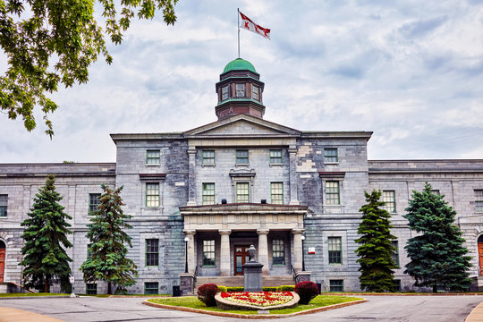

# McGill Awesome List
A list of all the resources for McGill students.

## 🏫 McGill Official Websites
- [McGill University](https://www.mcgill.ca)
- [Management Undergraduate Society](https://www.musmcgill.com/)
- [McGill Reddit](https://www.reddit.com/r/mcgill/)
- McGill Library
- McGill Writing Center

## 🎓 Students Developed Tools
- McGill Enhanced
- Find a Seat
- Visual Schedule Builder
- McGill Course Finder
- Doccum

## 👩‍💻 Open Source Projects
- McGill Innovations
- McGill Enhanced
- McGill App

## 🧑‍🏫 Student Services
- Campus Life and Engagements
- Career Planning Service
- First People's House
- International Student Services

## 🌎 McGill Discord Servers
- McGil Official Discord

## 🥐 Best Food in Montreal
- [Map of Best Places in Montreal](sasharesume.com/map)

